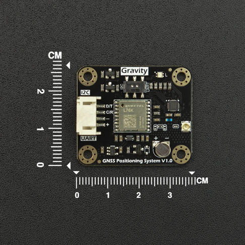

# DFRobot_RTK201
- [中文版](./README_CN.md)

Global Navigation Satellite Systems (GNSS) provide critical timing and positioning functions for device operations.
This Gravity: GNSS positioning module from DFRobot supports both single and multiple systems positioning. It is capable of quick delivery of position data like longitude, latitude, altitude and time. Compared with traditional single GPS positioning, the multi-system combination embraces higher precision and faster speed thanks to the increased number of visible and available satellites, which ensures stable and accurate performance even in complex urban environments.

With I2C and UART data outputs, the GNSS positioning module works well with main-controllers like Arduino, ESP32, and Raspberry Pi. It is applicable to outdoor positioning scenarios such as vehicle navigation, handheld positioning tracker, item tracking and weather station.



## Product Link(https://www.dfrobot.com/product-2651.html)

    SKU：TEL0157

## Table of Contents

* [Summary](#Summary)
* [Installation](#Installation)
* [Methods](#Methods)
* [Compatibility](#Compatibility)
* [History](#History)
* [Credits](#Credits)

## Summary

Provide an Arduino library for the GNSS module with the following features:
Retrieval of GNSS data
Retrieval of raw GNSS data.

## Installation
There are two methods for using this library:<br>
1. Open Arduino IDE, search for "DFRobot_RTK201" on the status bar in Tools ->Manager Libraries and install the library.<br>
2. Download the library file before use, paste it into \Arduino\libraries directory, then open the examples folder and run the demo in the folder.<br>

## Methods

```C++
/**
 * @fn getUTC
 * @brief Get utc standard time
 * @return sTim_t type, represents the returned hour, minute and second
 * @retval sTim_t.hour hour
 * @retval sTim_t.minute minute
 * @retval sTim_t.second second
 */
  sTim_t getUTC(void);

/**
 * @fn getDate
 * @brief Get the date like year, month and day
 * @return sTim_t type, represents the returned year, month and day
 * @retval sTim_t.year year
 * @retval sTim_t.month month
 * @retval sTim_t.day day
 */
  sTim_t getDate(void);

/**
 * @fn getLat
 * @brief Get latitude
 * @return sLonLat_t Type, represents the returned latitude 
 * @retval sLonLat_t.latDD   Latitude degree(0-90)
 * @retval sLonLat_t.latMM   Latitude  The first and second digits behind the decimal point 
 * @retval sLonLat_t.latMMMMM Latitude  The third and seventh digits behind the decimal point 
 * @retval sLonLat_t.latitude  Latitude value with 7 decimal digits 
 * @retval sLonLat_t.latDirection Direction of latitude 
 */
  sLonLat_t getLat(void);

/**
 * @fn getLon
 * @brief Get longitude 
 * @return sLonLat_t Type, represents the returned longitude 
 * @retval sLonLat_t.lonDDD  Longitude degree(0-90)
 * @retval sLonLat_t.lonMM   Longitude  The first and second digits behind the decimal point 
 * @retval sLonLat_t.lonMMMMM Longitude The third and seventh digits behind the decimal point 
 * @retval sLonLat_t.lonitude Longitude value with 7 decimal digits 
 * @retval sLonLat_t.lonDirection Direction of longitude 
 */
  sLonLat_t getLon(void);

/**
 * @fn getNumSatUsed
 * @brief Get the number of the used satellite used 
 * @return uint8_t type, represents the number of the used satellite
 */
  uint8_t getNumSatUsed(void);

/**
 * @fn getAlt
 * @brief Get altitude 
 * @return double type, represents altitude 
 */
  double getAlt(void);

/**
 * @fn getSog
 * @brief Get speed over ground 
 * @return speed Float data(unit: knot)
 */
  double getSog(void);

/**
 * @fn getCog
 * @brief Get course over ground 
 * @return Float data(unit: degree) 
 */
  double getCog(void);

/**
 * @fn setGnss
 * @brief Set GNSS to be used
 * @param mode
 * @n   eGPS              use gps
 * @n   eBeiDou           use beidou
 * @n   eGPS_BeiDou       use gps + beidou
 * @n   eGLONASS          use glonass
 * @n   eGPS_GLONASS      use gps + glonass
 * @n   eBeiDou_GLONASS   use beidou +glonass
 * @n   eGPS_BeiDou_GLONASS use gps + beidou + glonass
 * @return NULL
 */
  void setGnss(eGnssMode_t mode);

/**
 * @fn getGnssMode
 * @brief Get the used gnss mode
 * @return mode
 * @retval 1  gps
 * @retval 2  beidou
 * @retval 3  gps + beidou
 * @retval 4  glonass
 * @retval 5  gps + glonass
 * @retval 6  beidou +glonass
 * @retval 7  gps + beidou + glonass
 */
  uint8_t getGnssMode(void);

/**
 * @fn getAllGnss
 * @brief Get GNSS data, call back and receive 
 * @return null
 */
  void getAllGnss(void);

/**
 * @fn enablePower
 * @brief Enable gnss power
 * @return null
 */
void enablePower(void);

/**
 * @fn disablePower
 * @brief Disable gnss power
 * @return null
 */
void disablePower(void);


/**
 * @fn setRgbOn
 * @brief Turn rgb on 
 * @return null
 */
void setRgbOn(void);

/**
 * @fn setRgbOn
 * @brief Turn rgb off
 * @return null
 */
void setRgbOff(void);

/**
 * @fn setCallback
 * @brief Set callback function type 
 * @param  * call function name 
 * @return null
 */
  void setCallback(void (*call)(char *, uint8_t));

```

## Compatibility

MCU                | Work Well    |   Work Wrong    | Untested    | Remarks
------------------ | :----------: | :-------------: | :---------: | :----:
Arduino Uno        |      √       |                 |             |
Arduino MEGA2560   |      √       |                 |             |
Arduino Leonardo   |      √       |                 |             |
FireBeetle-ESP8266 |      √       |                 |             |
FireBeetle-ESP32   |      √       |                 |             |
FireBeetle-M0      |      √       |                 |             |
Micro:bit          |      √       | nonsupport uart |             |


## History

- 2022/04/02 - Version 0.0.1 released.
- 2022/10/26 - Version 1.0.0 released.

## Credits

Written by ZhixinLiu(zhixin.liu@dfrobot.com), 2022. (Welcome to our website)
